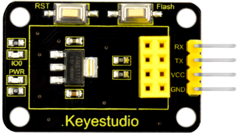
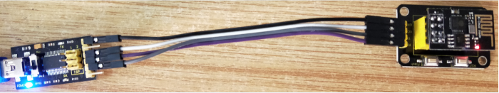
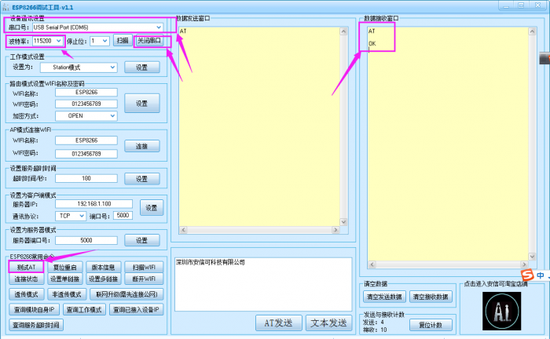
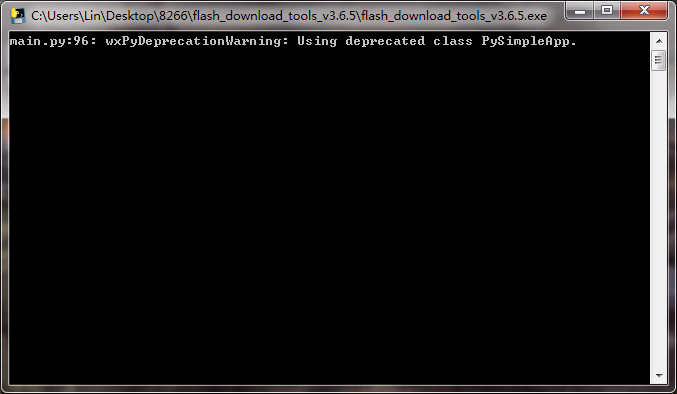
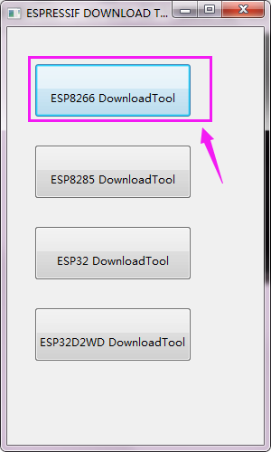
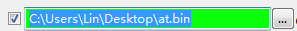
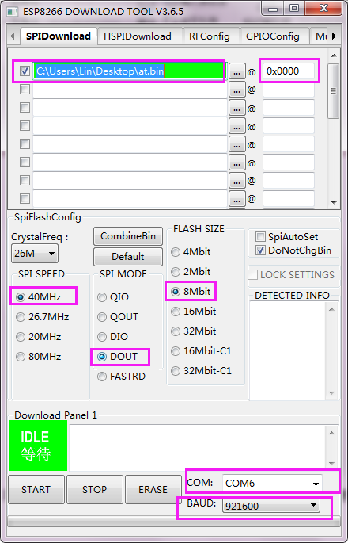
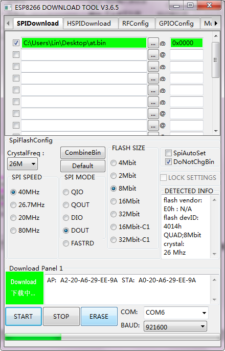
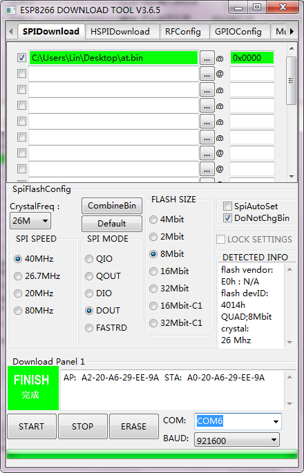
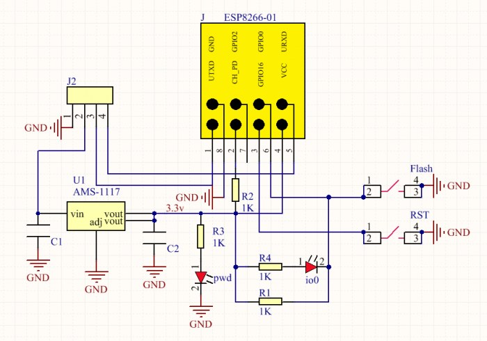

# KS0385 Keyestudio ESP 01S WIFI to Serial Shield for Arduino

**Resources download:** [Resources](./Resources.7z)

## 1. Introduction

This is an expansion board for the ESP-01S WiFi module. After power-on, the module is in BOOT flash mode. The AT command can be directly tested through the serial port on the shield.

To burn the firmware, first press and hold the Flash button on the shield, then click on burning on the software interface, and press the RST button.

When release the Flash button, the module will enter the download mode and start burning the firmware.

## 2. Technical Parameters

- Working voltage: DC 5V
- Working current: minimum 500mA
- Communication voltage: 3.3V
- Environmental attributes: ROHS
- Dimensions: 24mm * 41.3mm * 11.9mm
- Weight: 3.8g

## 3. Connection Method

| Shield | USB to Serial Module（FT232 Module） |
| ------ | ------------------------------------ |
| 3.3V   | 5V                                   |
| GND    | GND                                  |
| TX     | RX                                   |
| RX     | TX                                   |

## 4. Use Method

**1. AT Command Settings**

When testing the AT command, you should use a USB to Serial module, that is FT232 module, and an ESP8266 WIFI module. Connect well and then connect them to your computer using mini USB cable.

Connected successfully, open the ESP8266 debugging tool, set the baud rate to 115200, click to open the Serial Port, and click Test the AT.

You should see the data received window will print out **AT OK**.

To set other AT commands, the method is similar.

You can download the ESP8266 debugging tool from the link below:https://drive.google.com/open?id=1UAYAhdqr2iXO49ibkLyV4c2Aieteihs6

**2. Firmware Programming**

When setting the AT command, you should use a USB to Serial module, that is FT232 module, and a WIFI to serial shield. Connect well and then connect them to your computer using mini USB cable.

Then open flash_download_tools_v3.6.5software, click to open.

You can download the flash download tools v3.6.5 from the link:
https://drive.google.com/open?id=1Zjg-lg7ySsmN4C3A0Oz9UJCdXqtkdf_R

Wait for a minute, pop up the below interface, click the **ESP8266 Download Tool**.

Enter the interface to set the firmware burning. This is the address of firmware burning.

Hold the **FLASH** button on the shield, and Tap **START** button, then press **RST** button on the shield, release the **FLASH** button.The module will enter the download mode. Shown below.

Firmware download completed, can enter the corresponding software to set the AT command.

## 5.Schematic Diagram

